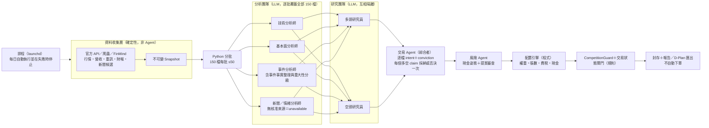

# 決策層 Agent 團隊重構計畫

2026-10-09 更新：S2 已完成，事件四子 Agent 移出每日決策鏈；新 team_inputs 2.1 與舊 2.0 分版重建。詳見 [整合契約](integrated_event_analysis.md)。

日期：2026-09-26。原驗收狀態：**R1～R6 已完成**；正式交易仍受交易狀態核准（TS0／TS5）阻擋。本計畫把決策層改為「分析團隊 → 多空研究 → 交易 → 風險」的分工，參考 [TradingAgents 的團隊分工](https://github.com/TauricResearch/TradingAgents#tradingagents-framework)；安全層（數值由 Python 計算、每一步 Validator、時間點檢查、不可變封存、不自動下單）完全保留。

2026-10-02 技術輸入補強：正式 technical brief 新增整段封存行情與逐日均線 `trend_history`，由 Python 建立及重建驗證，模型沿歷史路徑解讀上升／盤整／下降。未改 MomentumResult、AnalystReport 輸出契約或其他 Agent 邊界，詳見[技術分析整段歷史輸入](technical_trend_history.md)。

## 0. 設計原則：確定性歸程式，不確定性歸 LLM

**有唯一正確答案、可以重算驗證的，一律由程式計算；需要權衡、解讀或判斷的，才交給 LLM。** LLM 的輸出只能是有限選項的判斷（等級、立場、意圖）加上引用證據的理由，不得產生或改寫任何數字；程式負責驗證 LLM 輸出的格式、引用與一致性，但不替 LLM 做判斷，驗證失敗時停止而不是補預設值。

| 工作 | 性質 | 歸屬 |
| --- | --- | --- |
| 抓取、解析、版本化資料；時間點（cutoff）檢查 | 確定性 | 程式 |
| 技術指標、財務比率、動能、ATR、市場廣度與 regime 門檻 | 確定性 | 程式 |
| 分批、合併、覆蓋檢查、ID 與內容雜湊 | 確定性 | 程式 |
| 權重、張數、費稅、現金、委託單、壓力情境 | 確定性 | 程式 |
| 競賽規則（現金 <25%、20–30 檔、單檔上限）、交易狀態閘門 | 確定性 | 程式（Guard） |
| 解讀指標與財報代表什麼、事件重大程度、資料缺口的影響 | 不確定 | LLM（分析師） |
| 每檔最強的做多／做空論點 | 不確定 | LLM（多頭／空頭研究員） |
| 權衡多空後的買賣意圖與信心等級 | 不確定 | LLM（交易 Agent） |
| 市場風險高低 → 現金姿態；提案是否需要修正 | 不確定 | LLM（風險 Agent） |
| 等級與姿態換算成權重與現金比例 | 確定性 | 程式（依 Policy 對照表） |

判斷時的檢查方式：**同樣的輸入，兩個人做會不會得到同一個答案？** 會的，交給程式；不會、需要取捨的，交給 LLM，並要求它引用證據、只能在程式定義的選項中選擇。

## 1. 為什麼要改（2026-09-26 背景）

目前每日決策鏈（`automation/daily_pipeline.py`）是「買方 Agent（只提新標的）＋賣方 Agent（只看持股）→ 裁決 → 風控分級 → 風控審查」，有三個結構問題：

1. **新買進標的沒有反方論點。** 賣方只覆蓋持股，買方提名的新股票在裁決時只有支持 claim，裁決者聽不到任何反對理由。
2. **分析層沒有接進決策。** 基本面研究、事件研究都已實作，但每日流程只給降級的 ResearchResult；買方只看得到動能與月營收。
3. **多空辯論在錯的層級。** 多空只存在於單一事件研究（這則公告利多或利空），沒有針對「這檔股票整體該不該持有」辯論。

## 2. 當前架構（2026-10-09）

```text
Data Agent（既有）：行情、月營收、重大訊息、財報 → 不可變 Snapshot
        ↓
Python 分批（確定性）：官方 150 檔全部納入，依代號固定切成每批最多 50 檔
        ↓
分析團隊（每位分析師逐批執行，Python 合併並驗證覆蓋全部 150 檔）
  技術分析師｜基本面分析師｜事件與市場情緒分析師（無核准來源時 unavailable）
  high 事件保留重大性、發現與引用，直接交股票層級多空研究
        ↓ AnalystReport × 3
研究團隊：多頭研究員 vs 空頭研究員
  讀同一份分析報告與摘要、彼此隔離；兩方都必須覆蓋 150 檔每一檔（逐批）
        ↓ BullPacket ＋ BearPacket
交易 Agent：逐檔權衡多空 → buy／add／hold／trim／exit／no_trade 與信心等級
        ↓ TradeDecision（Python 依等級與 ATR 算權重、張數、委託單）
風險 Agent：市場風險 → 現金姿態；提案／情境／Guard 審查 → approve／revise／reject
        ↓ CompetitionGuard（競賽硬性規則）→ Finalize → 封存（DailyReport 已於 2026-09-29 移除；對外交付改由 D-Plan 匯出）
```

## 3. 各角色輸入、輸出與禁止事項

| 角色 | 執行者 | 讀取 | 輸出 | 禁止 |
| --- | --- | --- | --- | --- |
| 分批 | Python | Snapshot 交易池 | `UniverseBatches`：150 檔依代號固定切批（每批 ≤50），批次雜湊可重算；持股與非持股不分開 | 以 LLM 挑股或排除股票 |
| 技術分析師 | Agent | shortlist 的動能特徵（Python 已計算）、市場 regime | `AnalystReport(technical)` | 自行計算或改寫指標 |
| 基本面分析師 | Agent | 基本面確定性指標（`fundamentals` 工具）、月營收 | `AnalystReport(fundamental)` | 把成長率當市場共識；補寫缺漏財報 |
| 事件與市場情緒分析師 | Agent | 同 Snapshot 的公司事件、財報背景與已驗證市場資料包 | `AnalystReport(event)` 2.2，全市場情緒一次、公司事件逐檔；逐則標重大性 | 新增事實；公司新聞冒充全市場情緒；無核准來源補值 |
| 多頭研究員 | Agent | 三份 AnalystReport、角色摘要 | `BullPacket`：每檔最強的做多論點 | 讀取空頭 packet；輸出數字 |
| 空頭研究員 | Agent | 同上（相同 role input） | `BearPacket`：每檔最強的反對論點 | 讀取多頭 packet；輸出數字 |
| 交易 Agent | Agent | Bull／Bear packet、分析報告、持股 | `TradeDecision`：逐檔意圖、對 buy／add 的信心等級、採納／否決的 claim | 新增事實或 claim；輸出權重、張數 |
| 風險 Agent | Agent | 分析報告、TradeDecision；之後讀提案／情境／Guard | `cash_stance`；`RiskReview`（approve／revise／reject 與 allowlist 修正） | 手寫權重；覆寫 Guard；放寬規則 |
| 配置／Guard／封存 | Python | 以上已驗證 artifacts | Proposal、Scenario、Guard、Decision run | — |

### AnalystReport（新）

逐檔覆蓋交易池全部 150 檔（逐批產生後合併）。每檔：`outlook`（positive／negative／neutral／unknown）、`findings`（唯一 `finding_id`、文字、屬於該股票的 `evidence_ids`）、`data_gaps`。資料不足時必須標 `unknown` 並寫明缺口，不得省略股票。Validator 檢查覆蓋、引用歸屬、欄位白名單與內容雜湊。

### BullPacket／BearPacket（取代 Buy／Sell packet）

兩方由同一份 role input 產生、`peer_packet_ids` 必須為空、互相看不到。每檔：`strength`（strong／moderate／weak／none）、`claims`（唯一 `claim_id`、文字、`evidence_ids`、可引用的 `finding_ids`）、`invalidation_conditions`。`none` 代表該方找不到有證據的論點，仍須列出該股票。

### TradeDecision（取代 TradeIntentResult ＋ SizingPlan 的個股部分）

逐檔：`intent`、buy／add 時的 `conviction`（high／medium／low）、`adopted_claim_ids`／`rejected_claim_ids`（多空兩方每個 claim 剛好出現一次）、理由與未解問題。沿用現有規則：buy／add／trim／exit 必須採納同方向 claim；已持股不得 buy，未持股不得 add／hold／trim／exit。

### 風險 Agent

- 配置前：`cash_stance`（aggressive／neutral／defensive），沿用現行 `position_sizing.cash_buffer_by_stance` 對應現金比例。
- 配置後：沿用現行 `RiskReview` 與四種 allowlist 修正，Guard 失敗時確定性 reject。
- 比賽只能做多 150 檔股票，沒有放空、期貨或反向 ETF；避險手段限於提高現金（<25%）、減碼／出場、分散產業與避開高波動或事件風險標的。

## 4. 保留不動的部分

- `DecisionPolicy`（含 `position_sizing` 等級乘數 ÷ ATR 配置與現金姿態）、`AllocationOrderEngine`、`ScenarioEngine`、`CompetitionGuardV2`、`RevisionHistory`、`DecisionFinalizer`、`DecisionRepository`。
- `ClaudeAgentRunner`：Read 工具、`--json-schema`、錯誤回饋重試一次、仍失敗即停止。
- 確定性分支：空倉時空頭仍須評估候選（與舊賣方不同），但沒有股票時不呼叫 Agent；Guard 失敗時確定性 reject。

## 5. 契約升版與相容

- 新增 `AnalystReport`、`UniverseShortlist`、`BullPacket`／`BearPacket`（`ResearchDebateBundle`）、`TradeDecision`，決策鏈 schema 升為 2.0。
- `DecisionFinalizer`、`DecisionResultValidator`、`DecisionRepository` 的 artifact 集合改為新鏈；舊 1.0（Buy／Sell）鏈已於 2026-09-30 移除：`decision/trade_intent.py`、`role_brief`、SizingPlan、`portfolio-decision`／`buy-candidate`／`sell-exit`／`trade-adjudication` Skill 與相關 CLI 子命令都已刪除，Finalizer 與 Validator 對 1.0 debate 一律拒絕；既有封存 run 皆為 2.0，不受影響。
- 下游（虛擬帳本 `apply-decision`、DailyReport、D-Plan）讀取 Decision run 的欄位需逐一核對並補測試；若只讀 `DecisionResult.orders` 與 bundle，則不需改動。

## 6. 每日 Agent 呼叫次數

使用者決定不初篩、全部 150 檔進入分析。為避免單次輸出過大而截斷或驗證失敗，逐檔輸出的角色都分 3 批（每批 ≤50 檔）：分析 9 次（技術、基本面、事件各 3 批；情緒無資料時確定性）＋多空 6 次＋交易 3 次＋風險 1～2 次，另加每個重大事件 4 次。一般日約 20 次。每批只讀自己那批股票的資料與共同市場背景（regime），摘要約 50KB、一次可讀完；每批先單獨驗證、失敗只重跑該批，Python 合併後再驗證全體覆蓋與 ID 唯一性。claude.ai 訂閱登入時計入訂閱額度，不另計費。

## 7. 前置資料缺口

- **財報未入庫**：`financial_statements` 目前 0 筆，`start.sh daily` 未執行 `scripts/collect_financial_statements.py`。使用者決定每日收集（未更新內容自動去重）；入庫前基本面分析師只能用月營收，並須標示 `data_gaps`。
- **情緒資料**：無合法、歷史化來源，維持 `unavailable`。
- **交易狀態**：仍無核准來源（見 TS0），分析與多空照常覆蓋 `unknown` 股票，Guard 仍 fail-closed。

## 8. 開發階段

| 階段 | 交付 | 驗收 |
| --- | --- | --- |
| R1 資料與分批 | **已完成（2026-09-27）**：`start.sh daily` 以 `--latest-due` 每日收集財報（副本實測 2026 Q2 298／300，3718.TWO 缺兩張）；`automation/batching` 分批與合併 | 財報進入 Snapshot；分批可重算；合併後缺漏或重複即拒絕 |
| R2 分析團隊 | **R2a 已完成（2026-09-27）**：`decision/analysts`（AnalystReport 2.0、Validator、確定性摘要、基本面指標由 `fundamentals` 工具計算）、`technical-analyst`／`fundamental-analyst`／`event-analyst` Skill、`DailyDecisionPipeline.run_analyst_team`（逐批執行、單批重跑、合併驗證）、情緒確定性 unavailable；另修正 DecisionInputValidator 未允許 Snapshot 財報文件欄位。**R2b 已完成（2026-09-27）**：`automation/event_research_runner` 對 high 事件依序跑 Fact → Bull／Bear（只讀 FactPacket、互相隔離）→ Adjudicator，程式建立事件脈絡、價格特徵與 packet envelope 並組裝 ResearchResult 2.1；單一事件失敗時結果降級並記錄。ResearchResult 為獨立 artifact（不回寫已封存的 DecisionInputBundle），供多空、交易與報告使用 | 覆蓋全部 150 檔；引用歸屬正確；缺資料標 unknown；high 事件都有已驗證 ResearchResult |
| R3 多空研究 | **已完成（2026-09-27）**：`decision/stance`（StancePacket 2.0：每檔 strength strong／moderate／weak／none 與 claims；兩方共用 `shared_input_sha256`、role input 只差角色、`peer_packet_ids` 為空；claim_id 以 bull-／bear- 開頭、證據與 finding 須屬於該股票）、ResearchDebateBundle 2.0 Validator、`bull-researcher`／`bear-researcher` Skill、`DailyDecisionPipeline.run_research_team`（逐批、單批重跑、合併驗證） | 兩方覆蓋全部股票；互相隔離；claim 唯一 |
| R4 交易 Agent | **已完成（2026-09-27）**：`decision/trader`（TradeDecision 2.0：逐檔 intent、buy／add 的 conviction、每個多空 claim 剛好採納或否決一次；持股、動能與採納方向規則）、`apply_trade_decision`（信心等級＋風險 Agent 現金姿態綁入既有 `position_sizing`，配置引擎不變）、共用 `validate_cash_stance`、`trader` Skill、`DailyDecisionPipeline.run_trader` | 每個 claim 剛好採納或否決一次；等級可綁入 policy |
| R5 風險與鏈接 | **已完成（2026-09-27）**：`DailyDecisionPipeline.run_cash_stance`（程式統計市場層級摘要，風險 Agent 給現金姿態）；Decision run 沿用 `debate`／`intent` 名稱（新鏈為 ResearchDebateBundle 2.0／TradeDecision 2.0）並新增 `team_inputs`（四份分析報告、事件研究、現金姿態）；Finalizer／DecisionResultValidator 依 debate 版本分流，新鏈重建多空辯論、交易決策並核對 policy 綁定的等級與姿態，舊鏈 DecisionResult 內容與 ID 不變；配置引擎直接讀 TradeDecision；`save-run --team-inputs`；虛擬帳本、回測與 DailyReport 讀取並傳入 `team_inputs`。修正分級配置剛好封頂時手續費使成交後權重超過上限的問題（`LIMIT_HEADROOM` 0.995） | 新鏈 fixture 端到端 approved／rejected 均可重建 |
| R6 每日腳本 | **程式已完成（2026-09-27）**：`DailyDecisionPipeline._run` 改用新鏈並移除舊買賣／裁決／分級流程，`run_daily_pipeline.py` 以新鏈事件研究結果接 DailyReport；pipeline 測試改為新鏈端到端（核准、錯誤回饋重試、連續失敗不封存、交易狀態 unknown 時 Guard 拒絕）；新增 `resume`／`--resume`：同一 run 目錄中已通過目前 Validator 的 Agent 輸出直接沿用，原始輸出只新增不覆寫。**真實資料演練已完成（2026-09-28，資料庫與帳本副本）**：見下方 §10 | 真實 Snapshot 跑完並產出 DailyReport；舊鏈測試仍通過 |

每階段完成後執行完整 unittest、compileall、`git diff --check` 與新增 Skill 的 quick_validate，並同步 README、AGENTS.md 與相關 docs。

## 9. 使用者決定（2026-09-26）

1. **不初篩**：官方 150 檔全部進入分析、多空與交易；以分批執行控制單次輸出大小。
2. **財報每日收集**：併入 `start.sh daily`。
3. **事件研究**：事件分析師處理全部公告並標示重大程度；`materiality=high` 的事件另跑既有 Fact／Bull／Bear／Adjudicator 四子 Agent。

## 10. R6 真實資料演練紀錄（2026-09-28）

在資料庫與虛擬帳本副本上執行，不影響正式資料：Snapshot `a32c4fb3…`（cutoff 2026-09-26T16:04:14Z、行情 9/24、含 249 份 2026 Q2 財報文件）、10 億空倉、交易狀態全部 unknown。

- 首次執行 17.5 分鐘後撞到 claude.ai 工作階段用量上限而停止；以 `resume` 續跑，9 批分析師與第 1 則事件研究全部沿用，只重跑未完成的步驟，續跑 17.8 分鐘完成。兩段估算用量合計約 US$18（訂閱登入不另計費）。
- 分析師 9 批、多空 6 批、交易 3 批、現金姿態皆第一次通過驗證；Fact Agent 兩則事件都曾把價格特徵列為 verified_facts 並引用行情證據而重試一次，已在提示中明定只能引用正式文件。
- 技術 outlook：positive 56／neutral 59／negative 34／unknown 1（3718.TWO 行情不足）；基本面 positive 89／neutral 55／negative 5／unknown 1；39 則重大訊息分級 high 2／medium 8／low 29，兩則 high（3374.TWO、6919.TW）研究結果皆 uncertain／pending。
- 多頭 strength：strong 18／moderate 73／weak 52／none 7（232 claims）；空頭：strong 12／moderate 83／weak 55（236 claims）。交易 Agent：buy 36（high 10、medium 18、low 8）、no_trade 114；風險 Agent 現金姿態 neutral 並引用 regime、看法分布與事件證據。
- 配置：36 檔 buy 依等級排序截至 30 檔上限（MAX_POSITIONS 6 檔），實際 29 檔、現金 13.7%；Guard 只有 TRADABILITY_COVERAGE 與相關 SCENARIOS 未過，決策 rejected，符合交易狀態未核准時的 fail-closed。
- 報告工作流因 DecisionResult=rejected 只產出失敗報告與研究報告；失敗報告目前未列出 Guard 拒絕原因，列為後續改進。目標時段仍以下一個平日推算（此次為 9/28 休市日），交易日曆尚未接入。

## 2026-09-28 情緒／共識接入補充

情緒分析師已由固定 unavailable 改為已驗證 PerceptionDataBundle／MarketPerceptionResult 的確定性 adapter；每日流程可先透過既有 runner 全量標註，再由 Python 聚合。下游重建核對 adapter 全文，共識只作次級證據。無來源仍 unavailable，真實 Provider 尚待授權確認；見[操作與限制](daily_perception_account_integration.md)。

## 11. 架構調整提案（2026-09-30，尚未實作）

狀態：**提案**。以下調整尚未改動程式、契約與 Skill；§2～§10 仍是目前已實作的現況。目的是讓圖上每個「Agent」都真的在做判斷，並只保留一層多空辯論。

### 11.1 目標架構圖



### 11.2 與 §2 現況的差異

| 項目 | 現況（§2～§10） | 提案 | 理由 |
| --- | --- | --- | --- |
| Data Agent | 命名為 Agent，實際是確定性收集、驗證、版本化 | 改稱「資料收集層」，不再稱 Agent | 它沒有 LLM 判斷；圖上只留真正做判斷的 Agent |
| 重大事件研究 | 事件分析師標 high 後，另跑 Fact／Bull／Bear／Adjudicator，再繞到多空研究員 | 收進分析團隊：事件事實擷取由程式完成，事件分析師給 `materiality` 與有證據的發現；不再另跑一輪四子 Agent 辯論 | 多空辯論只保留一層（多頭／空頭研究員），避免同一事件吵兩次 |
| 新聞分析師 | 事件分析師兼顧公告；情緒分析師在無核准來源時確定性 unavailable | 明確列出新聞／情緒分析師一席，仍受 `license_status=approved` 限制 | 你要求分析團隊涵蓋新聞；無合法來源前仍輸出 unavailable，不以搜尋摘要冒充 |
| 綜合者 | 交易 Agent 已做權衡，但文件未稱其為綜合者 | 在文件與圖上明確定義交易 Agent 為綜合者 | 職責不變，只是說清楚 |
| 風險 Agent 位置 | 交易 Agent 之後給現金姿態（`run_cash_stance`），配置後再審查 | 不變 | 順序已符合「綜合 → 風險 → 配置」 |
| 報告 | DailyReport 已移除，對外交付為 D-Plan 匯出 | 不變 | — |
| 自動化 | 已有 `start.sh daily` 與 launchd 範本，未涵蓋完整決策鏈 | 明列為待完成範圍 | 見 11.3 |

不變的原則：數值與規則歸程式、Bull／Bear 互相隔離、Trader 不新增事實、Risk 不手寫權重或覆寫 Guard、不自動下單。

### 11.3 範圍清單（S2 已完成，其他項目依個別進度）

| 編號 | 工作 | 主要影響 | 風險 |
| --- | --- | --- | --- |
| S1 | 文件與圖更新：README 與 AGENTS.md 把 Data Agent 改稱資料收集層，同步 `data_agent_plan.md` 等引用 | 文件；不改程式與 Skill 名稱 | 低 |
| S2（2026-10-09 已完成） | 事件研究併入分析團隊：事件事實擷取改為程式（`analyze_event_context` 已是確定性），移除 `run_material_event_research` 的 Fact／Bull／Bear／Adjudicator 四步 | `automation/event_research_runner.py`、`daily_pipeline.py`、`ResearchResult` 2.1 契約、`event-*` Skill、Decision run 的 `team_inputs`、下游驗證 | **高**：影響封存 run 重建與 Validator；需相容策略或版本升級 |
| S3 | 新聞／情緒分析師：新增或改寫 `AnalystReport(news)`，接既有已驗證 `PerceptionDataBundle` adapter；無核准來源時確定性 unavailable | `decision/analysts.py`、`sentiment-analyst` Skill、測試 | 中；真實新聞來源授權仍待確認 |
| S4（2026-10-09 已完成） | 交易 Agent 明確化為綜合者：更新 Skill 與契約文字，不改欄位 | `trader` Skill、文件 | 低 |
| S5 | 每日完整自動化：排程跑完整決策鏈、失敗時停止並保留可 `resume` 的 run、通知與日誌 | `scripts/launchd/`、`start.sh`、`run_daily_pipeline.py` | 中；不得自動下單，不得放寬 Guard |
| S6 | 失敗報告補列 Guard 拒絕原因（§10 已列為後續改進） | 報告與 D-Plan 匯出 | 低 |
| S7 | 並行化：多空兩方與各批分析可平行，縮短單日執行時間 | `ClaudeAgentRunner`、pipeline | 中；須保持隔離與可重算 |

建議順序：S1 → S4 → S6 → S5 → S3 → S2 → S7。S2 改動最大且牽動封存相容，應在 S1 確認方向後單獨決定。

### 11.4 原待決定事項（S2 已於 2026-10-09 確認並完成）

1. S2 是否採用「事件研究併入分析團隊」，以及舊 `ResearchResult` 2.1 封存 run 如何處理（保留重建路徑或升版）。
2. 新聞來源是否有可核准的授權路徑；沒有的話 S3 只先建立角色與 unavailable 行為。
## 基本面資料補抓（2026-10-03）

對外報告改為正面／中性／負面及中文具體報表缺口。`data_gap_explanations` 由程式依快照建立；只增加摘要及呈現規則，不改內部 outlook 契約或 unknown 的安全狀態。

金融業當期欄位映射 v2 已支援稅後淨利別名與獨立淨收益。fundamental brief 新增有來源證據及單位的 financial_facts，分析師只解讀當期原值，不自行計算成長率；跨年口徑未確認時維持降級。

基本面分析師資料不足時交回 Data Agent，一輪補抓後由主控重建指標與摘要，再分析新版本。`cli/fundamental_repair.py` 支援 TWSE 一般業當期核對 FinMind 歷史單季合計；不是分析師直接新增事實，也未接上每日排程自動重跑。歷史 cutoff 不能納入今天補抓的資料。範圍與降級規則見 [基本面缺口補抓](fundamental_data_repair.md)。

## 事件與市場情緒合併決定（2026-10-03，已實作）

當前交付再調整為 2.2：第三位分析師分開交付一次整體台股情緒與逐股公司事件，不產生混合綜合分數。每日批次組裝與重建驗證已接入；全市場情緒 Provider 尚未接入，目前保留 unavailable。舊 2.1 逐股情緒報告仍可依原輸入驗證，不能改寫為新版。參見 [市場與公司範圍](event_market_scope.md)。

三份分析 Skill 已改用自然中文說明工作目的、分析主線與最後結果；英文欄位、引用與補抓細節移至各自的 `references/data-rules.md`，要求執行前讀取。事件與情緒對外每檔呈現一個綜合結果，內部分項與逐則事件仍保留。缺少資料不當成中性。此整理不變更三位 Agent 的分工、正式 JSON 格式、數值計算、歷史時點與來源核對規則，也不表示新聞候選已接入正式情緒通道。

使用者決定合併事件／新聞分析師與情緒分析師。當前團隊為技術、基本面、事件與市場情緒共三位，各交付一份報告。每日 pipeline 不再產生獨立 analyst_sentiment 報告。事件 skill 保留既有名稱 event-analyst，報告鍵保留 event，格式升為 2.1，增加 event_outlook 與程式重建的 sentiment 通道。

此決定取代 §2 的四席呈現及 §11 的獨立新聞／情緒席位提案。S2 已於 2026-10-09 完成：high 事件直接交股票層級多空研究；舊封存仍保留原始驗證。情緒資料標註、授權檢查及聚合仍保留在資料端；真實 Provider 尚未接入。三份新報告及舊四份封存輸入不得混搭，詳細見 [合併契約](event_sentiment_merge.md)。

2026-10-05：第三位分析師新增版本化 market_news_input 全市場 RSS 通道，來源、完整標籤及綜合判讀由程式重建；未核准來源仍 unavailable，診斷不進交易。詳見 [接入說明](market_news_integration.md)。

2026-10-05：全市場新聞增加1.1歷史原頁接入與分頁補抓，仍全項目標籤、同源重建、核准來源才進正式計算。補抓 available_at 保留實際時間，不回填歷史時鐘。詳見 [補抓說明](market_news_history.md)。

## S2 已完成（2026-10-09）

使用者確認移除每日鏈的重大事件四子 Agent 研究。當前每日流程為資料收集 → 三位分析師 → 股票層級多空研究員 → 交易 → 風險姿態 → 確定性配置／Guard／風險審查 → 重建驗證與封存。§4～§10 保留原實作驗收紀錄，其中獨立事件辯論不再是新鏈要求。

新 team_inputs 2.1 不含 research_result；舊 2.0 必須保留原始事件研究並按原版本驗證，不改寫封存。high 仍逐則覆蓋、引用和分級，沒有假造空 ResearchResult。詳見 [事件研究併入分析團隊](integrated_event_analysis.md)。

## S4 已完成（2026-10-09）

交易 Agent 明確定位為多頭／空頭研究的整合者。主 prompt 要求先比較證據、處理兩方分歧，再說明每個論點的取捨與逐檔交易決定；正式欄位和驗證規則移至 trader 的 references/data-rules.md。修正舊 Skill 的四位分析師描述為目前三位；UI 與架構圖顯示「交易 Agent（多空整合）」。TradeDecision 2.0、全 claim 覆蓋、持股／動能閘門及風控契約不變。
